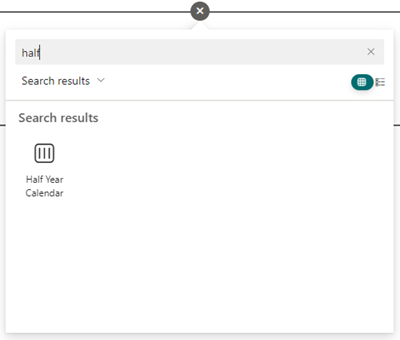

# Half Year Calendar

Skip to
* [Installation](#installation)
* [Development](#development)

## Presentation

Long term planning of events can be difficult using the standard views in SharePoint, this web part fills this gap by providing a calendar that shows events for 6 months:

## Installation

1. Download the latest package `half-year-calendar-webpart.sppkg` from [releases](https://github.com/vestas-digital-employee-tools/half-year-calendar/releases).

2. Add `half-year-calendar-webpart.sppkg` to the global tenant app catalog or a site collection app catalog. If you don't have an app catalog, follow this [procedure](https://docs.microsoft.com/en-us/sharepoint/use-app-catalog) to create one.

3. Add the Web Part to a page.

4. When inserted on a page, it will show events from the first Calendar list on the site.

## Development

-   Install [Node.js](https://nodejs.org/) `v18`
-   Fork & clone the repository
-   `npm install`
-   `npm run dev`
-   Make changes

Guidelines:

-   Use [Tailwind](https://tailwindcss.com/) instead of Sass
-   Use React function components
